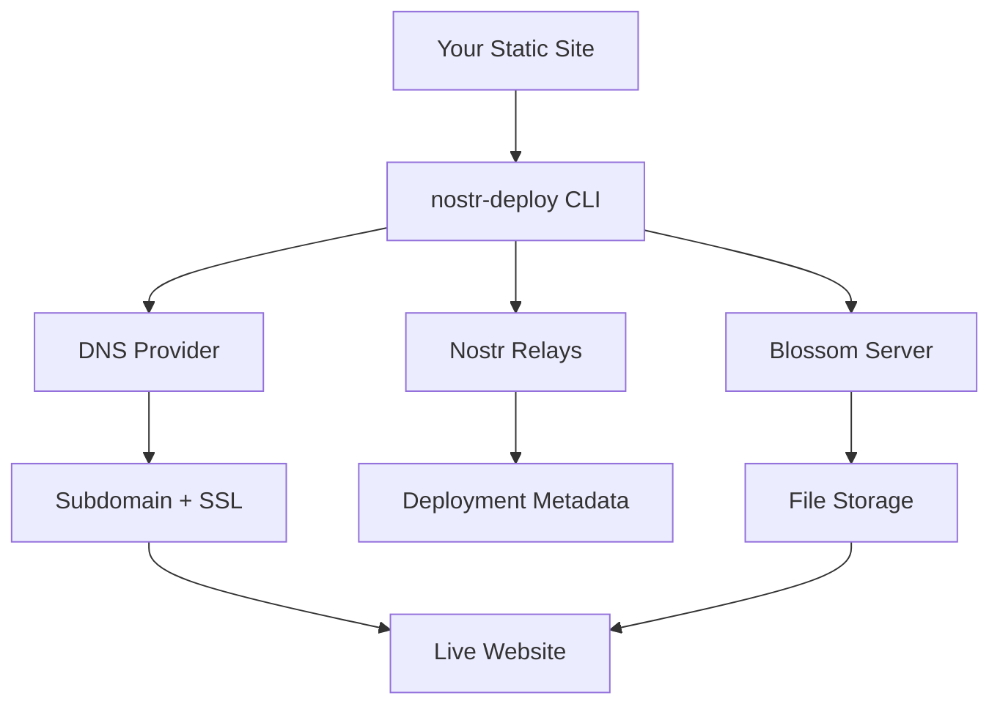

# Nostr Deploy CLI

> A revolutionary CLI tool for deploying static sites using the Nostr protocol and Blossom servers

[](https://badge.fury.io/js/nostr-deploy-cli)
[](https://opensource.org/licenses/MIT)

## 🌟 What makes this special?

Nostr Deploy CLI leverages the **decentralized Nostr protocol** and **Blossom servers** to provide a unique static site deployment experience:

- **🔐 Decentralized Authentication**: No traditional accounts needed - authenticate with your Nostr keys
- **🌸 Blossom Storage**: Your files are stored on decentralized Blossom servers
- **📡 Nostr Integration**: Deployment metadata is published to Nostr relays
- **🌐 Automatic Subdomains**: Get instant subdomains with SSL certificates
- **🚀 Zero Configuration**: Deploys React, Vue, Angular, and any static site

## 🚀 Quick Start

### Installation

```bash
npm install -g nostr-deploy-cli
```

### Development / Local Usage

If you're developing or want to test locally without global installation:

```bash
# Clone and setup
git clone <repository-url>
cd nostr-deploy-cli
npm install
npm run build

# Run CLI directly
node dist/cli.js help
node dist/cli.js auth
node dist/cli.js config

# Or create a local symlink (recommended for development)
npm link
nostr-deploy help  # Now works globally during development

# Remove the symlink when done
npm unlink -g nostr-deploy-cli
```

### Initial Setup

1. **Authenticate with Nostr:**

```bash
nostr-deploy auth
```

Choose to generate new keys or import existing ones.

2. **Configure deployment settings:**

```bash
nostr-deploy config
```

Set up Blossom server, base domain, and other preferences.

3. **Deploy your first site:**

```bash
cd your-react-app
npm run build
nostr-deploy deploy
```

That's it! Your site is now live with a unique subdomain and SSL certificate.

## 📋 Commands

### `nostr-deploy auth`

Set up Nostr authentication

**Options:**

- `-k, --key <key>` - Import private key (nsec format)
- `-p, --pubkey <pubkey>` - Import public key only (npub format)

**Examples:**

```bash
# Interactive setup
nostr-deploy auth

# Import existing private key
nostr-deploy auth -k nsec1abc123...

# Import public key only (read-only mode)
nostr-deploy auth -p npub1xyz789...
```

### `nostr-deploy config`

Configure deployment settings

**Options:**

- `-r, --relays <relays...>` - Nostr relay URLs
- `-b, --blossom <url>` - Blossom server URL
- `-d, --domain <domain>` - Base domain for subdomains

**Examples:**

```bash
# Interactive configuration
nostr-deploy config

# Set specific options
nostr-deploy config -b https://blossom.myserver.com -d mysite.dev
```

### `nostr-deploy deploy`

Deploy your static site

**Options:**

- `-d, --dir <directory>` - Build directory (default: auto-detect)
- `-n, --name <name>` - Site name
- `--subdomain <subdomain>` - Custom subdomain (if available)

**Examples:**

```bash
# Auto-detect build directory
nostr-deploy deploy

# Specify build directory
nostr-deploy deploy -d ./dist

# Deploy with custom name and subdomain
nostr-deploy deploy -n "My Blog" --subdomain my-blog
```

### `nostr-deploy status`

Check deployment status

**Options:**

- `-s, --subdomain <subdomain>` - Check specific subdomain

**Examples:**

```bash
# List all deployments
nostr-deploy status

# Check specific site
nostr-deploy status -s my-site-abc123
```

## 🏗️ How It Works

### 1. **Authentication with Nostr**

- Generate or import Nostr key pairs (public/private keys)
- No traditional account registration required
- Keys are stored securely in your local config

### 2. **File Upload to Blossom**

- Static files are uploaded to decentralized Blossom servers
- Each file gets a unique SHA-256 hash for integrity
- A manifest is created linking all files together

### 3. **Subdomain & SSL Management**

- Automatic subdomain generation (e.g., `abc123.nostrsite.dev`)
- DNS records are configured automatically
- SSL certificates issued via Let's Encrypt

### 4. **Nostr Metadata Publishing**

- Deployment information is published to Nostr relays
- Includes subdomain, file hashes, and deployment timestamp
- Enables decentralized deployment history

### 5. **Live Site Serving**

- Your subdomain points to a proxy that serves files from Blossom
- Global CDN distribution for fast loading
- Automatic HTTPS with valid SSL certificates

## 🔧 Configuration

Configuration is stored in `~/.nostr-deploy/config.json`:

```json
{
  "nostr": {
    "privateKey": "hex-encoded-private-key",
    "publicKey": "hex-encoded-public-key",
    "relays": ["wss://relay.damus.io", "wss://nos.lol", "wss://relay.nostr.band"]
  },
  "blossom": {
    "serverUrl": "https://blossom.server.example.com"
  },
  "deployment": {
    "baseDomain": "nostrsite.dev",
    "sslProvider": "letsencrypt",
    "dnsProvider": "cloudflare"
  }
}
```

## 🛠️ Supported Frameworks

Works with any static site generator or framework:

- **React** (`npm run build` → `./build`)
- **Vue.js** (`npm run build` → `./dist`)
- **Angular** (`ng build` → `./dist`)
- **Next.js** (`next build && next export` → `./out`)
- **Gatsby** (`gatsby build` → `./public`)
- **Svelte** (`npm run build` → `./public`)
- **Jekyll** (`jekyll build` → `./_site`)
- **Hugo** (`hugo` → `./public`)

## 🌐 Architecture



## 🔒 Security & Privacy

- **Decentralized**: No central authority controls your deployments
- **Encrypted Communication**: All API calls use HTTPS/WSS
- **Key Security**: Private keys never leave your machine
- **Content Integrity**: SHA-256 hashes ensure file integrity
- **SSL/TLS**: All sites automatically get valid SSL certificates

## 🌍 Nostr Ecosystem

This tool is part of the growing Nostr ecosystem:

- **Nostr Protocol**: Decentralized social media protocol
- **Blossom Servers**: Decentralized file storage network
- **Relay Network**: Distributed message/metadata storage
- **Key Management**: Compatible with existing Nostr clients

## 🤝 Contributing

We welcome contributions! Please see our [Contributing Guide](CONTRIBUTING.md) for details.

### Development Setup

```bash
# Clone the repository
git clone https://github.com/your-username/nostr-deploy-cli.git
cd nostr-deploy-cli

# Install dependencies
npm install

# Build the project
npm run build

# Test locally
npm run dev
```

## 📝 License

MIT License - see [LICENSE](LICENSE) file for details.

## 🙏 Acknowledgments

- [Nostr Protocol](https://github.com/nostr-protocol/nostr) - Decentralized communication protocol
- [Blossom Servers](https://github.com/hzrd149/blossom) - Decentralized file storage
- [nostr-tools](https://github.com/nbd-wtf/nostr-tools) - JavaScript Nostr library

## 🔗 Links

- [Nostr Protocol Website](https://nostr.com/)
- [Blossom Documentation](https://github.com/hzrd149/blossom)
- [Example Deployments](#)
- [API Documentation](#)

---

**Made with ❤️ for the decentralized web**
