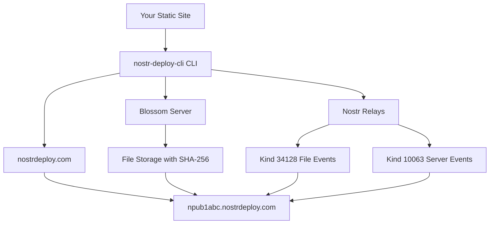

# Nostr Deploy CLI

> A revolutionary CLI tool for deploying static sites using the Nostr protocol and Blossom servers following the **Pubkey Static Websites NIP**

[](https://badge.fury.io/js/nostr-deploy-cli)
[](https://opensource.org/licenses/MIT)

## 🌟 What makes this special?

Nostr Deploy CLI leverages the **decentralized Nostr protocol** and **Blossom servers** with the **Pubkey Static Websites NIP** standard to provide a unique static site deployment experience:

- **🔐 Decentralized Authentication**: No traditional accounts needed - authenticate with your Nostr keys
- **🔑 NPub Subdomains**: Your public key (npub) becomes your unique subdomain
- **🌸 Blossom Storage**: Your files are stored on decentralized Blossom servers
- **📡 NIP-Compliant**: Uses kind 34128 events for file metadata and kind 10063 for server lists
- **🌐 Automatic Subdomains**: Get instant subdomains automatically
- **🚀 Zero Configuration**: Deploys React, Vue, Angular, and any static site

## 🏗️ How It Works - Pubkey Static Websites NIP

### 1. **NPub Subdomain Generation**

- Your Nostr public key (npub) becomes your subdomain: `npub1abc123....nostrdeploy.com`
- No random subdomains - your identity is tied to your Nostr key
- Consistent subdomain across all deployments

### 2. **File Metadata Publishing (Kind 34128)**

- Each file is published as a kind 34128 Nostr event
- Contains `d` tag with absolute file path (e.g., `/index.html`)
- Contains `x` tag with SHA-256 hash of the file content
- Enables decentralized file discovery and integrity verification

### 3. **Server List Publishing (Kind 10063)**

- BUD-03 user servers event specifies which Blossom servers host your files
- Host servers can discover and serve files from the correct Blossom instances
- Enables redundancy and decentralized hosting

### 4. **Host Server Resolution**

- Host servers resolve `npub1xyz.nostrdeploy.com` requests
- Fetch user's kind 34128 events for the requested path
- Retrieve files from Blossom servers using SHA-256 hashes
- Serve with proper Content-Type headers

## 🚀 Quick Start

### Installation

```bash
npm install -g nostr-deploy-cli
```

### Instant Deploy

Want to deploy immediately? Use the fast deploy option:

```bash
# Navigate to your project and deploy in one command
cd your-project-directory
nostr-deploy-cli deploy --skip-setup
```

This auto-generates keys and deploys without any setup required!

### Development / Local Usage

If you're developing or want to test locally without global installation:

```bash
# Clone and setup
git clone <repository-url>
cd nostr-deploy-cli
npm install
npm run build

# Run CLI directly
node dist/cli.js help
node dist/cli.js auth
node dist/cli.js config

# Or create a local symlink (recommended for development)
npm link
nostr-deploy-cli help  # Now works globally during development

# Remove the symlink when done
npm unlink -g nostr-deploy-cli
```

### Initial Setup

**Each project has its own local configuration and Nostr identity.**

1. **Navigate to your project directory:**

```bash
cd your-project-directory
```

2. **Set up authentication for this project:**

```bash
nostr-deploy-cli auth
```

Your project's npub will become your subdomain: `npub1abc123....nostrdeploy.com`

3. **Configure deployment settings for this project:**

```bash
nostr-deploy-cli config
```

4. **View your project's configuration:**

```bash
nostr-deploy-cli info
```

5. **Deploy your site:**

```bash
# Build your site first (if needed)
npm run build

# Deploy to your project's npub subdomain
nostr-deploy-cli deploy
```

Your site is now live at `https://npub1abc123....nostrdeploy.com`!

**Note:** Each project directory has its own `.env.nostr-deploy.local` configuration file with its own Nostr identity. This allows you to deploy different projects to different npub subdomains.

### 🚀 Fast Deploy (Skip Setup)

For quick deployments without manual setup, use the `--skip-setup` flag:

```bash
# Build your site first (if needed)
npm run build

# Auto-generate keys and deploy in one command
nostr-deploy-cli deploy --skip-setup
```

This will:

- 🔍 Check for existing authentication configuration in the project
- 🔄 Reuse existing keypair if found, or auto-generate a new one if needed
- ⚙️ Set up default configuration (relays, Blossom server, domain) for missing settings
- 💾 Display keys for you to save securely (if newly generated)
- 🚀 Deploy immediately to your npub subdomain

**Important:** Save the generated private key (nsec) securely! You'll need it for future deployments.

## 📋 Commands

### `nostr-deploy-cli auth`

Set up Nostr authentication for the current project

**Options:**

- `-k, --key <key>` - Import private key (nsec format)
- `-p, --pubkey <pubkey>` - Import public key only (npub format)

**Examples:**

```bash
# Interactive setup - generates new keys for this project
nostr-deploy-cli auth

# Import existing private key for this project
nostr-deploy-cli auth -k nsec1abc123...

# Import public key only (read-only mode)
nostr-deploy-cli auth -p npub1xyz789...
```

### `nostr-deploy-cli info`

Display local project configuration and authentication status

**Examples:**

```bash
# View current project's configuration
nostr-deploy-cli info
```

### `nostr-deploy-cli config`

Configure deployment settings for the current project

**Options:**

- `-r, --relays <relays...>` - Nostr relay URLs
- `-b, --blossom <url>` - Blossom server URL
- `-d, --domain <domain>` - Base domain for subdomains

**Examples:**

```bash
# Interactive configuration for this project
nostr-deploy-cli config

# Set specific options for this project
nostr-deploy-cli config -b https://blossom.hzrd149.com -d nostrdeploy.com
```

### `nostr-deploy-cli deploy`

Deploy your static site using Pubkey Static Websites NIP

**Options:**

- `-d, --dir <directory>` - Build directory (default: auto-detect)
- `--skip-setup` - Skip auth and config steps, reuse existing config or auto-generate keypair and deploy

**Examples:**

```bash
# Auto-detect build directory and deploy to this project's npub subdomain
nostr-deploy-cli deploy

# Specify build directory
nostr-deploy-cli deploy -d ./dist

# Deploy with specific directory
nostr-deploy-cli deploy -d ./out

# Fast deploy: auto-generate keys and deploy in one command
nostr-deploy-cli deploy --skip-setup

# Fast deploy with specific directory
nostr-deploy-cli deploy --skip-setup -d ./build
```

### `nostr-deploy-cli status`

Check deployment status for your project's npub subdomain

**Options:**

- `-s, --subdomain <npub>` - Check specific npub subdomain

**Examples:**

```bash
# List all deployments for this project
nostr-deploy-cli status

# Check specific npub subdomain status
nostr-deploy-cli status -s npub1abc123...
```

## 🔧 Configuration

Configuration is stored locally in each project directory as `.env.nostr-deploy.local`:

```bash
# Nostr Deploy CLI Configuration
# This file contains sensitive information - do not commit to version control

# Nostr Authentication
NOSTR_PRIVATE_KEY=your-hex-private-key
NOSTR_PUBLIC_KEY=your-hex-public-key
NOSTR_RELAYS=wss://relay.damus.io,wss://nos.lol,wss://relay.nostr.band

# Blossom File Storage
BLOSSOM_SERVER_URL=https://blossom.hzrd149.com

# Deployment Settings
BASE_DOMAIN=nostrdeploy.com

# Proof of Work (Optional)
NOSTR_POW_ENABLED=false
NOSTR_POW_DIFFICULTY=30
NOSTR_POW_TIMEOUT=30000
```

**Important Notes:**

- Each project has its own `.env.nostr-deploy.local` configuration file
- The `.env.nostr-deploy.local` file should be included in `.gitignore`
- Different projects can use different Nostr identities and settings
- Private keys are stored locally and never shared between projects
- Environment variable format makes it easy to integrate with CI/CD pipelines

## ⚡ Proof of Work (PoW) Support

This CLI implements **NIP-13 Proof of Work** to help prevent spam on Nostr relays that require a minimum PoW for event acceptance.

### Configuring PoW

**Interactive Configuration:**

```bash
# Configure PoW interactively
nostr-deploy-cli config
# Select "⚡ Proof of Work" option
```

**Command Line Configuration:**

```bash
# Enable PoW with default difficulty (30)
nostr-deploy-cli config --pow

# Enable PoW with custom difficulty
nostr-deploy-cli config --pow --pow-difficulty 25

# Disable PoW
nostr-deploy-cli config --no-pow

# Set PoW with timeout (30 seconds)
nostr-deploy-cli config --pow --pow-difficulty 30 --pow-timeout 30000
```

**Environment Variables:**

```bash
NOSTR_POW_ENABLED=true
NOSTR_POW_DIFFICULTY=30
NOSTR_POW_TIMEOUT=30000  # Optional timeout in milliseconds
```

### PoW Performance Guidelines

- **Difficulty 0-15**: Very fast (milliseconds to seconds)
- **Difficulty 16-20**: Moderate (seconds to tens of seconds)
- **Difficulty 21-25**: Slow (minutes)
- **Difficulty 26+**: Very slow (may take hours)

**Recommended Settings:**

- **Development**: Difficulty 10-12
- **Production**: Difficulty 16-18
- **High security relays**: Difficulty 20+

### How PoW Works

1. When PoW is enabled, the CLI adds a `nonce` tag to events before signing
2. It iteratively tries different nonce values until the event ID has the required number of leading zeros
3. The actual difficulty achieved may be higher than the target
4. Events with PoW are more likely to be accepted by spam-filtering relays

**PoW Event Example:**

```json
{
  "kind": 34128,
  "content": "",
  "tags": [
    ["d", "/index.html"],
    ["x", "186ea5fd14e88fd1ac49351759e7ab906fa94892002b60bf7f5a428f28ca1c99"],
    ["nonce", "12345", "16"]
  ],
  "id": "0000a1b2c3d4..." // ID starts with zeros (difficulty 16)
}
```

## 📡 Nostr Events Published

### Static File Events (Kind 34128)

```json
{
  "kind": 34128,
  "content": "",
  "tags": [
    ["d", "/index.html"],
    ["x", "186ea5fd14e88fd1ac49351759e7ab906fa94892002b60bf7f5a428f28ca1c99"]
  ]
}
```

### User Servers Event (Kind 10063)

```json
{
  "kind": 10063,
  "content": "",
  "tags": [["server", "https://blossom.hzrd149.com"]]
}
```

## 🌐 Architecture



## 🔒 Security & Privacy

- **Decentralized**: No central authority controls your deployments
- **Cryptographic Identity**: Your npub is cryptographically tied to your private key
- **Content Integrity**: SHA-256 hashes ensure file integrity
- **Verifiable**: Anyone can verify your site's authenticity via Nostr events
- **Censorship Resistant**: Distributed across multiple relays and Blossom servers

## 🛠️ NIP Compliance

This tool implements multiple Nostr protocol specifications:

**Pubkey Static Websites NIP:**

- ✅ Kind 34128 events for static file definitions
- ✅ Absolute paths in `d` tags
- ✅ SHA-256 hashes in `x` tags
- ✅ NPub subdomain resolution
- ✅ Kind 10063 BUD-03 user servers events
- ✅ Fallback to `/index.html` for directory requests
- ✅ `/404.html` fallback for not found pages

**NIP-13 Proof of Work:**

- ✅ Mining proof-of-work for events
- ✅ Configurable difficulty levels
- ✅ Nonce tags with target difficulty
- ✅ Timeout protection for PoW computation

## 🌍 Nostr Ecosystem

This tool is part of the growing Nostr ecosystem:

- **Nostr Protocol**: Decentralized social media protocol
- **Blossom Servers**: Decentralized file storage network
- **Relay Network**: Distributed message/metadata storage
- **Key Management**: Compatible with existing Nostr clients

## 🤝 Contributing

We welcome contributions! Please see our [Contributing Guide](CONTRIBUTING.md) for details.

### Development Setup

```bash
# Clone the repository
git clone https://github.com/your-username/nostr-deploy-cli.git
cd nostr-deploy-cli

# Install dependencies
npm install

# Build the project
npm run build

# Test locally
npm run dev
```

## 📝 License

MIT License - see [LICENSE](LICENSE) file for details.

## 🙏 Acknowledgments

- [Nostr Protocol](https://github.com/nostr-protocol/nostr) - Decentralized communication protocol
- [Blossom Servers](https://github.com/hzrd149/blossom) - Decentralized file storage
- [nostr-tools](https://github.com/nbd-wtf/nostr-tools) - JavaScript Nostr library

## 🔗 Links

- [Nostr Protocol Website](https://nostr.com/)
- [Blossom Documentation](https://github.com/hzrd149/blossom)
- [Example Deployments](#)
- [API Documentation](#)

---

**Made with ❤️ for the decentralized web**
