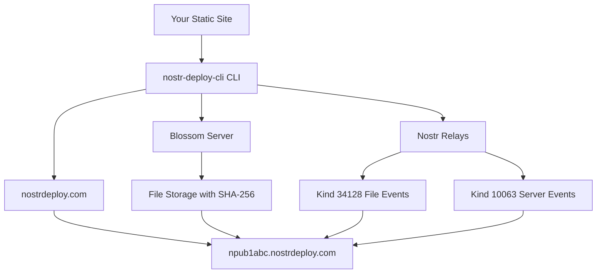

# Nostr Deploy CLI

> A revolutionary CLI tool for deploying static sites using the Nostr protocol and Blossom servers following the **Pubkey Static Websites NIP**

[](https://badge.fury.io/js/nostr-deploy-cli)
[](https://opensource.org/licenses/MIT)

## 🌟 What makes this special?

Nostr Deploy CLI leverages the **decentralized Nostr protocol** and **Blossom servers** with the **Pubkey Static Websites NIP** standard to provide a unique static site deployment experience:

- **🔐 Decentralized Authentication**: No traditional accounts needed - authenticate with your Nostr keys
- **🔑 NPub Subdomains**: Your public key (npub) becomes your unique subdomain
- **🌸 Blossom Storage**: Your files are stored on decentralized Blossom servers
- **📡 NIP-Compliant**: Uses kind 34128 events for file metadata and kind 10063 for server lists
- **🌐 Automatic SSL**: Get instant subdomains with SSL certificates
- **🚀 Zero Configuration**: Deploys React, Vue, Angular, and any static site

## 🏗️ How It Works - Pubkey Static Websites NIP

### 1. **NPub Subdomain Generation**

- Your Nostr public key (npub) becomes your subdomain: `npub1abc123....nostrdeploy.com`
- No random subdomains - your identity is tied to your Nostr key
- Consistent subdomain across all deployments

### 2. **File Metadata Publishing (Kind 34128)**

- Each file is published as a kind 34128 Nostr event
- Contains `d` tag with absolute file path (e.g., `/index.html`)
- Contains `x` tag with SHA-256 hash of the file content
- Enables decentralized file discovery and integrity verification

### 3. **Server List Publishing (Kind 10063)**

- BUD-03 user servers event specifies which Blossom servers host your files
- Host servers can discover and serve files from the correct Blossom instances
- Enables redundancy and decentralized hosting

### 4. **Host Server Resolution**

- Host servers resolve `npub1xyz.nostrdeploy.com` requests
- Fetch user's kind 34128 events for the requested path
- Retrieve files from Blossom servers using SHA-256 hashes
- Serve with proper Content-Type headers

## 🚀 Quick Start

### Installation

```bash
npm install -g nostr-deploy-cli
```

### Development / Local Usage

If you're developing or want to test locally without global installation:

```bash
# Clone and setup
git clone <repository-url>
cd nostr-deploy-cli
npm install
npm run build

# Run CLI directly
node dist/cli.js help
node dist/cli.js auth
node dist/cli.js config

# Or create a local symlink (recommended for development)
npm link
nostr-deploy-cli help  # Now works globally during development

# Remove the symlink when done
npm unlink -g nostr-deploy-cli
```

### Initial Setup

1. **Authenticate with Nostr:**

```bash
nostr-deploy-cli auth
```

Your npub will become your subdomain: `npub1abc123....nostrdeploy.com`

2. **Configure deployment settings:**

```bash
nostr-deploy-cli config
```

3. **Deploy your first site:**

```bash
cd your-react-app
npm run build
nostr-deploy-cli deploy
```

Your site is now live at `https://npub1abc123....nostrdeploy.com`!

## 📋 Commands

### `nostr-deploy-cli auth`

Set up Nostr authentication

**Options:**

- `-k, --key <key>` - Import private key (nsec format)
- `-p, --pubkey <pubkey>` - Import public key only (npub format)

**Examples:**

```bash
# Interactive setup - generates new keys and shows your npub subdomain
nostr-deploy-cli auth

# Import existing private key
nostr-deploy-cli auth -k nsec1abc123...

# Import public key only (read-only mode)
nostr-deploy-cli auth -p npub1xyz789...
```

### `nostr-deploy-cli config`

Configure deployment settings

**Options:**

- `-r, --relays <relays...>` - Nostr relay URLs
- `-b, --blossom <url>` - Blossom server URL
- `-d, --domain <domain>` - Base domain for subdomains

**Examples:**

```bash
# Interactive configuration
nostr-deploy-cli config

# Set specific options
nostr-deploy-cli config -b https://blossom.hzrd149.com -d nostrdeploy.com
```

### `nostr-deploy-cli deploy`

Deploy your static site using Pubkey Static Websites NIP

**Options:**

- `-d, --dir <directory>` - Build directory (default: auto-detect)
- `-n, --name <name>` - Site name

**Examples:**

```bash
# Auto-detect build directory and deploy to your npub subdomain
nostr-deploy-cli deploy

# Specify build directory
nostr-deploy-cli deploy -d ./dist

# Deploy with custom name
nostr-deploy-cli deploy -n "My Blog"
```

### `nostr-deploy-cli status`

Check deployment status for your npub subdomain

**Options:**

- `-s, --subdomain <npub>` - Check specific npub subdomain

**Examples:**

```bash
# List all your deployments
nostr-deploy-cli status

# Check your npub subdomain status
nostr-deploy-cli status -s npub1abc123...
```

## 🔧 Configuration

Configuration is stored in `~/.nostr-deploy-cli/config.json`:

```json
{
  "nostr": {
    "privateKey": "hex-encoded-private-key",
    "publicKey": "hex-encoded-public-key",
    "relays": ["wss://relay.damus.io", "wss://nos.lol", "wss://relay.nostr.band"]
  },
  "blossom": {
    "serverUrl": "https://blossom.hzrd149.com"
  },
  "deployment": {
    "baseDomain": "nostrdeploy.com",
    "sslProvider": "letsencrypt",
    "dnsProvider": "cloudflare"
  }
}
```

## 📡 Nostr Events Published

### Static File Events (Kind 34128)

```json
{
  "kind": 34128,
  "content": "",
  "tags": [
    ["d", "/index.html"],
    ["x", "186ea5fd14e88fd1ac49351759e7ab906fa94892002b60bf7f5a428f28ca1c99"]
  ]
}
```

### User Servers Event (Kind 10063)

```json
{
  "kind": 10063,
  "content": "",
  "tags": [["server", "https://blossom.hzrd149.com"]]
}
```

## 🌐 Architecture



## 🔒 Security & Privacy

- **Decentralized**: No central authority controls your deployments
- **Cryptographic Identity**: Your npub is cryptographically tied to your private key
- **Content Integrity**: SHA-256 hashes ensure file integrity
- **Verifiable**: Anyone can verify your site's authenticity via Nostr events
- **Censorship Resistant**: Distributed across multiple relays and Blossom servers

## 🛠️ NIP Compliance

This tool implements the **Pubkey Static Websites NIP** specification:

- ✅ Kind 34128 events for static file definitions
- ✅ Absolute paths in `d` tags
- ✅ SHA-256 hashes in `x` tags
- ✅ NPub subdomain resolution
- ✅ Kind 10063 BUD-03 user servers events
- ✅ Fallback to `/index.html` for directory requests
- ✅ `/404.html` fallback for not found pages

## 🌍 Nostr Ecosystem

This tool is part of the growing Nostr ecosystem:

- **Nostr Protocol**: Decentralized social media protocol
- **Blossom Servers**: Decentralized file storage network
- **Relay Network**: Distributed message/metadata storage
- **Key Management**: Compatible with existing Nostr clients

## 🤝 Contributing

We welcome contributions! Please see our [Contributing Guide](CONTRIBUTING.md) for details.

### Development Setup

```bash
# Clone the repository
git clone https://github.com/your-username/nostr-deploy-cli.git
cd nostr-deploy-cli

# Install dependencies
npm install

# Build the project
npm run build

# Test locally
npm run dev
```

## 📝 License

MIT License - see [LICENSE](LICENSE) file for details.

## 🙏 Acknowledgments

- [Nostr Protocol](https://github.com/nostr-protocol/nostr) - Decentralized communication protocol
- [Blossom Servers](https://github.com/hzrd149/blossom) - Decentralized file storage
- [nostr-tools](https://github.com/nbd-wtf/nostr-tools) - JavaScript Nostr library

## 🔗 Links

- [Nostr Protocol Website](https://nostr.com/)
- [Blossom Documentation](https://github.com/hzrd149/blossom)
- [Example Deployments](#)
- [API Documentation](#)

---

**Made with ❤️ for the decentralized web**
